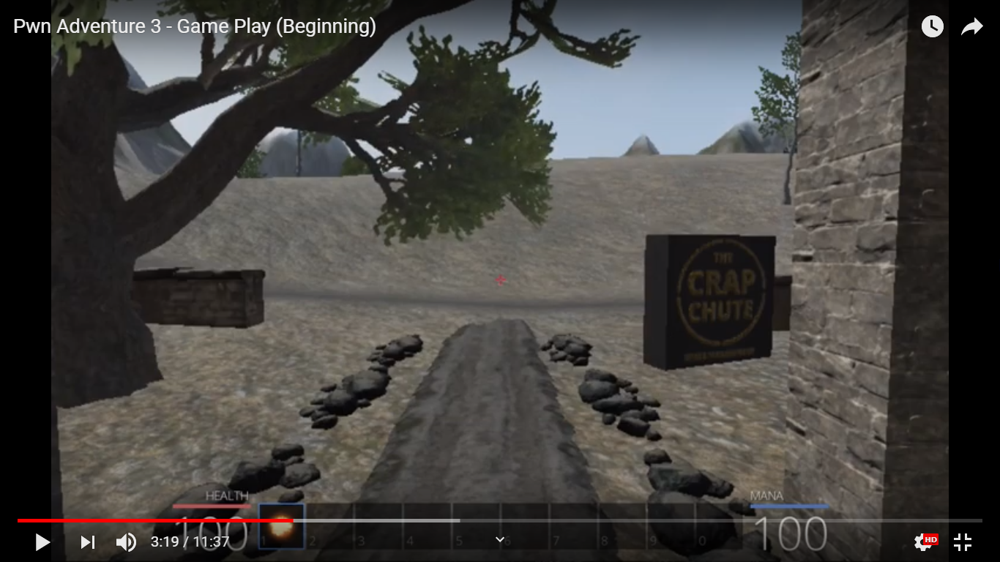

# A glamorous_noob meets Pwn Adventure 3

## (1) Baby steps

### Contents

[I - "Playing" the game](#i---playing-the-game)

[II - Defining my first objective](#ii---defining-my-first-objective)

[III - Exploring  the game files](#iii---exploring--the-game-files)

[IV - Getting distracted by `.pak` files](#iv---getting-distracted-by-pak-files)

[V - Creating a Ghidra project](#v---creating-a-ghidra-project)

------

### I - "Playing" the game

The first thing that comes to mind before reversing a video game is, well, playing it.
If you've read a little bit about the game, you probably know that the game has a Windows client, a Linux client, and a server. The original server is theoretically still running with reduced resources so people could connect if they want, but it is still recommended to download and install a copy of the server locally (as far as I understood).

I went for the Windows client for the following reasons:

1. I have only one personal computer.
2. I engage in the ancient practice of gaming from time to time.
3. I had a free copy of Windows as a student benefit thingy.
4. I hate dual boot
5. I wanted to improve my RE of Windows anyway since I was better at reversing Linux executables

And since I was too lazy when I installed the Windows client, I've made the following two compromises:

1. I played the game with my mousepad and keyboard, because I didn't want to move my butt to look for my USB mouse, and I didn't feel like testing it with my gamepad.
2. I didn't install a local version of the server and I tried to play using the original one. It didn't work (Not sure if related to the whole reduced resources thing or if that's something I should configure or hack later), so I chose the "Offline Option"


I created a player, walked around a little bit, learned a new spell, and then turned it off because the whole mousepad thing was making it difficult. So I ended up just watching [a bit of the gameplay on YouTube.](https://www.youtube.com/watch?v=PHZJ443zVM0) It's too bad this video has no sound because the music of the game is great.

### II - Defining my first objective

So I watched the gameplay till the part where the player gets out of "The Crap Chute".



And I thought, "I'd like to have infinite Health and Mana Points for starters, and maybe kill enemies automatically?". I mean, I ***am*** playing with my mousepad after all...

And so, a new objective was born right out of my laziness, my very first one for this game!

### III - Exploring  the game files

The second thing that comes to mind is just looking at the game files, their extensions, how many executables are there and which ones seem interesting. So here's a representation of what I found. 

```
/
│   PwnAdventure3.exe
│
└───Engine
│   [Configuration files and binaries]
│   
└───PwnAdventure3
    │
    └───Binaries\Win32
    │   	GameLogic.dll
    │   	GameLogic.pdb
    │   	libeay32.dll
    │		PwnAdventure3-Win32-Shipping.exe
    │		ssleay32.dll
    │	
    └───Config
    │   	DefaultEditor.ini
    │   	DefaultEngine.ini
    │   	DefaultGame.ini
    │   	DefaultInput.ini
    └───Content
    	│
    	└───Paks
    	│	[Crapload of .pak files]
    	└───Server
    		[config file + server certificate]
```

So to sum it up, there are configuration files, interesting executables like `PwnAdventure3-Win32-Shipping.exe` and `GameLogic.dll`, and library files used for cryptography: `libeay32.dll`and `ssleay32.dll`. BUT: I didn't know what `.pak` files were and it drove me nuts.

### IV - Getting distracted by `.pak` files

I looked them up and found some useful quotes like:

> A PAK file is an archive used by video games such as Quake, Hexen, Crysis, Far Cry, Half-Life, and Exient XGS Engine games. It may include graphics, objects, textures, sounds, and other game data "packed" into a single file. PAK files are often just a renamed [.ZIP](https://fileinfo.com/extension/zip) file.

and:

> PAK files are primarily used by video games but may also be used by other applications such as the Google Chrome web browser. The format for a PAK file used by one game may differ from the PAK format used for a different game. Therefore, you may have to try multiple programs before opening your PAK file.

So naturally I tried opening them `.pak` files like I would do with an archive, it didn't work.
I also tried using python's module *"expak"* which is supposed to extract and process Quake-style `.pak` files. But it just gave me this sad sad message:

```python
>>> import expak
>>> expak.resource_names("Content0.pak")
Content0.pak is not a pak file
```

I tried to just `strings`the hell out of them but there were faaaar too many useless strings and I couldn't `grep` since I didn't quite know what strings I would be looking for. Maybe some file paths? I could come up with a regex maybe? I thought it could be effective but it would take time so I thought I'd dismiss this idea for the time being.

My last  *quick* attempt was to read a `.pak` file with `xxd` and pipe it to `less`. I was scrolling down aimlessly at first, and then I just jumped to the end of the file. I FOUND STRINGS. Absolute luck, but still. Now I knew what kind of strings I was looking for, which resulted in this:

```bash
$ strings Content0.pak | grep uasset
Architecture/Floor_400x400.uasset
Architecture/Pillar_50x500.uasset
Architecture/Wall_400x200.uasset
Architecture/Wall_400x300.uasset
Architecture/Wall_400x400.uasset
Architecture/Wall_500x500.uasset
Architecture/Wall_Door_400x300.uasset
Architecture/Wall_Door_400x400.uasset
Architecture/Wall_Window_400x300.uasset
Architecture/Wall_Window_400x400.uasset
Blueprints/AIZoneVolume.uasset
Blueprints/AreaEntryVolume.uasset
Blueprints/AreaInfo.uasset
Blueprints/Audio/MusicManager.uasset
...
```

Maybe this is not the only kind of strings in the file, but the `.uasset` extension made me find out that it's the extension used by UnrealEngine. So now I know I'm dealing with some *probably* unencrypted UnrealEngine `.pak` files.
Next time I look into them for any reason, I should look for the official unpacker, or just look how the game itself uses them. Maybe it's a simple extraction algorithm I can replicate with python.

But, for now, my curiosity regarding these files has been satisfied.

### V - Creating a Ghidra project

Like the title says, I created a Ghidra project in which I imported the executables and decided I'll write about the next steps in a new file.

------


*[Dramatic voice asking questions about whether I'll succeed or not in the next episode, anime style]*

Stay tuned and stuff.