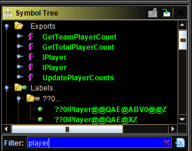
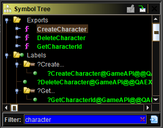
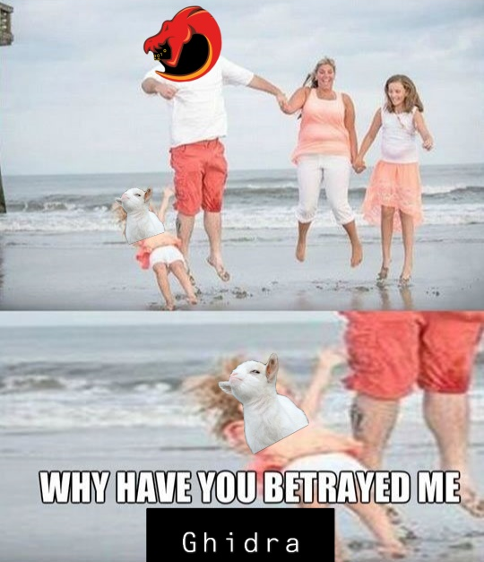
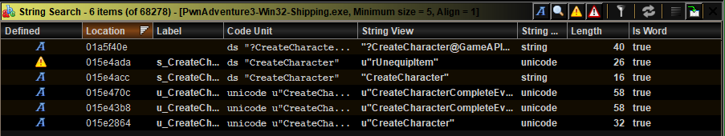
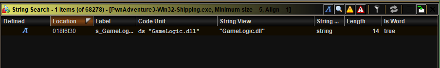
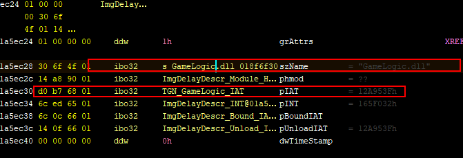

# A glamorous_noob meets PwnAdevnture3

## (2) Tu quoque, Brute?
### Contents
[I - Summary](#i---summary)

[II - First glance at `GameLogic.dll`](#ii---first-glance-at-gamelogicdll)

[III - A look at the other 2 executables](#iii---a-look-at-the-other-2-executables)

[IV - Clues and false dead ends](#iv---clues-and-false-dead-ends)

[V - Partially solving the vftable problem](#v---partially-solving-the-vftable-problem)

[VI - Ghidra's betrayal - Part 1](#vi---ghidras-betrayal---part-1)

[VI - Ghidra's betrayal - Part 2](#vi---ghidras-betrayal---part-2)

[VII - So what's next?](#vii---so-whats-next)

------
### I - Summary

This episode begins with me looking for a way to have infinite Health Points and Mana Points. You might recall I said something about firing automatically at enemies but I decided that that is way too far fetched for a first objective. Soooo, it's only about HP and MP this time.

After I finished writing the first episode, I executed the following steps **meticulously**:

- [x] Import and run analysis on `GameLogic.dll`, `PwnAdventure3-Win32-Shipping.exe`, and `PwnAdventure3.exe` in Ghidra
- [x] Suspect `GameLogic.dll` is the most relevant binary to look into if I want to have infinite HP and MP
- [x] Failing to find anything useful and deciding to look into the other two binaries anyway
- [x] I confirm the main purpose of `PwnAdventure3.exe`, that is to execute `PwnAdventure3-Win32-Shipping.exe` (to no one's surprise), but I fail to find useful stuff in `PwnAdventure3-Win32-Shipping.exe` itself
- [x] Suspecting I might be an idiot
- [x] Going back and forth between parts of code I thought were interesting but hitting a dead-end every single time 

- [x] Accepting I really might be an idiot
- [x] Learning a SHITLOAD of stuff about RTTI structures, vftables, and the PE format (especially imports and exports)
- [x] FINALLY understanding one of the reasons my first attempts didn't work. Spoiler alert: ***<u>Ghidra has betrayed me.</u>***

The rest of this document will go into some of the details of these steps.

### II - First glance at `GameLogic.dll` 

When I opened `GameLogic.dll` for the first time, I was looking for places where HP and MP were reduced, right? So I thought I'd look for functions or classes containing the word "Character" or "Player". I only found functions whose names suggested creating characters, deleting characters, and team management (team players count, etc.). I couldn't find any symbols related to mana or health.

So here I've made at least two major mistakes. One of those mistakes is not taking a look at strings... I can find no excuse for this blunder to be honest. The second mistake was **NOT** looking at the classes and functions **WITHOUT** filtering. If I had just looked without filtering or looked at the strings I would've spent less time being lost.

Also, I had a hard time because I didn't know at the time what RTTI (Run-time Type Information) is and how to make use of vftables (Virtual Function Tables), even though I had a brief idea about what vftables were. If you don't know what those are, they are structures used to implement dynamic binding and polymorphism in OOP (Object-Oriented Programming) in C++. But more on that in the world wide web! [Here's an example](https://www.learncpp.com/cpp-tutorial/125-the-virtual-table/). [Here's another one.](http://www.openrce.org/articles/full_view/23)

### III - A look at the other 2 executables

When I started reversing `PwnAdventure3.exe`, I thought to myself: *"This exe probably calls another program since its size is only 435 KB, I want to confirm that."* I know about one Windows API function for creating another process and that is `CreateProcess` (and of course the two variants `CreateProcessA` and `CreateProcessW` but it's still the same core). I searched for the function in the symbol tree and found one reference to it. I read its documentation to find that the second argument is the command line for the new process to be executed. I trace the argument back to where it was created and to no one's surprise, it is the canonical path to `PwnAdventure3-Win32-Shipping.exe`.

While I was doing that I learned about several Windows API functions, how the `.rsrc`segment works globally and I thought about how lousy it is not to know of a "GetResourceById" thingy in Ghidra that would jump to the address of the resource given its ID. It might be there without me knowing about it, or it might be easily programmable, but didn't really look further. I needed to look for only one resource so I did it manually.

Besides that, I tried searching in the symbol tree for symbols containing "Character", "Player", "Health", "Mana" in `PwnAdventure3-Win32-Shipping.exe`, but to no avail.

### IV - Clues and false dead ends

This time, I thought I'd actually look into the code of `CreateCharacter` whose symbol seen in the previous screenshot of `GameLogic.dll`, hoping it would give me information about *where* a character is created and what attributes it has.

The first obvious clue I found was `DAT_10097d84` which by the looks of it containted either a boolean keeping track of the state of the master server connection or, most probably, a the address of a [singleton](https://en.wikipedia.org/wiki/Singleton_pattern) master server connection object (whose format is unclear yet). The other clue was the vftable whose address is being stored into a stack variable. This is what made me look for and find all the other vftables in this binary, along with RTTI structures which I had no clue about before this project. While doing that, I recognized classes from the first 3 minutes of the gameplay like `GiantRat` and `GreatBallsOfFire`.

I wasn't able to advance anymore on `CreateCharacter` though since I had no idea what kind of data was being manipulated in this function. I couldn't find a `Character` class. And following the vftable link led me to this nightmare:

So I moved to looking at classes who actually had human-readable names like those of spells and enemies, thinking if I do understand their format maybe I will find things related to mana consumption. The vftables of spell-representing classes contained a little less than 40 function pointers. Apprently they all implemented the IItem interface, I spent a lot of time trying to figure out what certain functions did. A lot of them were easy since they consisted of returning a string (like a toString method or a getDescription or getTitle etc.) , but most of them were not, especially without knowing the structure of the class being manipulated. I tried to manually create types for classes and separate types for vftables so I would have something like `someobject->vftable.toStringmethod()` instead of the dreadful `(code*)((*(void**)someobject)+0xc)()` that a decompiler would typically create without having the right types. I made some effort but it was a big mess of not knowing where to start.

The same problem occurred again when I found a class called `Player` that had TWO vftables because it had multiple inheritance. The combined total of pointers in this class's vftables is about 100. 

### V - Partially solving the vftable problem

I finally decided to make a little script called `rename_vftable_funcs.py` allowing me to give names to vftable functions telling me which class they belong to as well as their position in the vftable. It was a huge help spotting common virtual functions between classes. The details are in the `Ghidra_scripts`folder of this project.

### VI - Ghidra's betrayal - Part 1

An object in C++ has a pointer to its vftable if it has any virtual functions. There are no official specifications to where that vftable pointer is but it is usually the first field in the object, and a lot of the code I saw seemed to suggest that (a lot of `((*this)+small_offset)()`). So I thought: what if the vftable reference in the `CreateCharacter` function was really the vftable of `Character` or at least one of its base classes? And suddenly the function made a lot more sense, and I lost my faith in Ghidra.

I did have similar problems with IDA and radare2 too before, like badly decoded instructions or unfound strings and xrefs, so I guess it's bound to happen with any tool.

Anyway, I backed up the project and decided to rename the class  to `Character` and went from there. After following with `CreateCharacter` I was able to determine the size of a `Character` object and a few of its fields. I still needed to understand the meaning of two of the parameters and for that I needed to find the function's call in `PwnAdventure3-Win32-Shipping.exe`. Which leads me to Ghidra's second betrayal.

### VI - Ghidra's betrayal - Part 2

I found it very weird the first time when I searched for the word `Character` in the symbol tree of `PwnAdventure3-Win32-Shipping.exe` and couldn't find any reference to the `CreateCharacter` function of `GameLogic.dll`. So this time I looked for the string "CreateCharacter" in the string search tool, and I found this:

The first result shows that there **SHOULD** be imports from the `GameAPI` class which is defined in `GameLogic.dll`, except I couldn't find any. Searching for "GameLogic.dll" yielded this as a result:

With absolutely no sign of GameLogic.dll in the symbol tree, I started tackling how PE exectables handle imports and exports and I found these particular two links to be really useful: [link#1](http://ulsrl.org/pe-portable-executable/) , [link#2](http://www.openrce.org/reference_library/files/reference/PE%20Format.pdf). Thanks to that, and by retracing the reference made to the "GameLogic.dll" string, I was able to find my way up to the IAT (Import Address Table) of `GameLogic.dll`!

In spite of that, that when I follow the IAT address, I find a list of "normal" function addresses and not thunk function addresses as they should be. That's the second Ghidra betrayal. It did not map the thunk functions to their names in the imported dll.

### VII - So what's next?

I have these 4 options:

- If it's a configuration problem, try to reimport the binary, with the `.pdb`this time (because the first time there was an error while importing it) and test out the different configurations.
- If it's an analysis bug, try to work my way around it with scripting
- Try analysing the same files with a different tool (IDA, radare2, etc.) and see if there's a difference
- Put my exploration of the `Character` class on hold, and look at the `Player` and `Actor`classes first who are more likely to have what I need anyway (HP and MP fields), and by this I avoid the need to look into the imports problem right away

------

At the time being, I don't know which decision I'll make. That will be for the next episode.

As dear Haytham Kenway would say, *"May the Father of Understanding guide us."*

