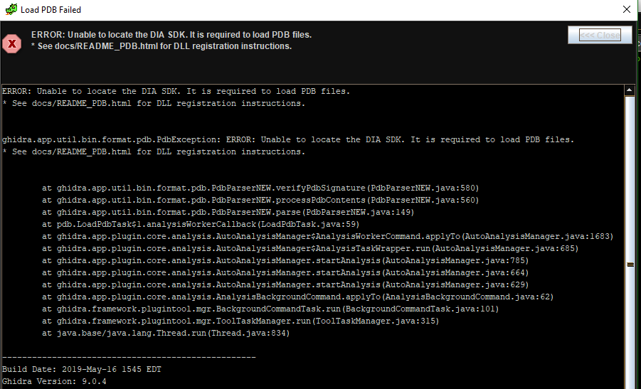
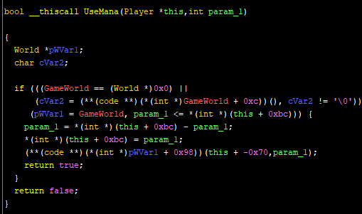
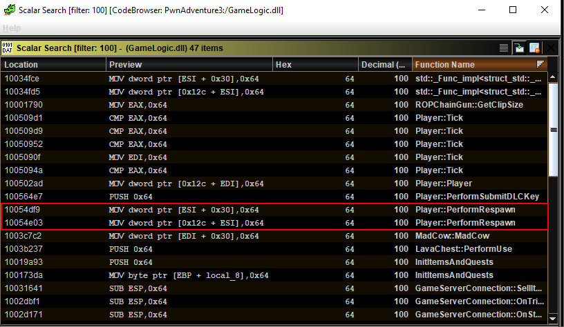

# A glamorous_noob meets Pwn Adevnture 3

## (3) Infinite MANA POWAAA
### Contents
[I - TLDR](#i---tldr)

[II - Solving the `.pdb` issue](#ii---solving-the-pdb-issue)

[III - A NEW ERA](#iii---a-new-era)

[IV - Identifying patch location](#iv---identifying-patch-location)

[V - Problem while exporting](#v---problem-while-exporting)

[VI - Scalar search inspiration](#vi---scalar-search-inspiration)

------

### I - TLDR

- Make a copy of `GameLogic.dll` (as backup)
- Open it with a hex editor
- Go to `0x519c3` offset
- Write `90 90 90 90` instead of `7c e6 29 d0`, replacing `JL` and `SUB` instructions with 4 `NOP` instructions
- Run the game (make sure the modified file is called `GameLogic.dll`)
- Enjoy infinite mana

### II - Solving the `.pdb` issue

<u>A recap of the issue:</u> A [`.pdb` file](https://en.wikipedia.org/wiki/Program_database) is pretty useful for reverse engineering because it has a lot of information about symbols, their structure, where they are, etc. And as I've shown in episode 1, there was a `GameLogic.dll` and a `GameLogic.pdb`. According to Ghidra, it is best to include the `.pdb`(by setting its path correctly in the `.dll`'s options) ***before*** the first analysis. Here's what happened at the end of the first analysis, with the path set correctly and everything:

So I didn't really know what the DIA SDK was and I just wasn't aware enough of how useful a `.pdb` file is, so I kinda ignored it at first until the end of the last episode... *All hail Their Glamorous Noobness.*

I tried to follow the `README_PDB.html` instructions, which were basically installing a Microsoft C++ redistributable package and then finding a certain `msdia140.dll` at a certain path and then registering it. I installed the freakin' package and I didn't have the supposed path. The `msdia140.dll`was nowhere on my system. But [@MalwareTech](https://github.com/MalwareTech)'s [repo](https://github.com/MalwareTech/MSDIA-x64) did the trick! After checking on [VirusTotal](https://www.virustotal.com/) that the file provided is in fact a trusted legitimate file signed by microsoft, I registered and it worked like magic. And that's what I should have done since the beginning, instead of ignoring the error message and suffering for a couple of weeks...

> "I will always choose a lazy person to do a difficult job because a lazy person will find an easy way to do it."
>
> ~Supposedly Bill Gates or whatever

Sorry pseudo-deep bullshit quote, you're overrated. A lazy person can very much end up doing more work than needed, and I just proved it :sunglasses: (I know I shouldn't be proud about it though :sweat: )

Also, [Bill Gates probably never said that](https://quoteinvestigator.com/2014/02/26/lazy-job/) despicable cancerous disgusting self-indulging pretending-to-be-modern-and-cool quote. Let us all stop that HOAX please.

### III - A NEW ERA

Here's how the `.pdb` file changed things:

- Searching for words like "mana" and "damage" in the symbol tree yields results
- Functions in most vftables have their original names. AND THAT'S nice.
- Some types even have their corresponding structures in the data type manager, like `CharacterInfo` (the class I called `Character` in the last episode probably)
- Global functions and referenced data addresses have overall better typing and naming
- Thanks to all the new names I got, I was sure `Player` is the right class to look at for infinite HP and MP

This was all beautiful. So beautiful, that tears would've flowed out of Their Glamorous Noobness's eyes, if goats had tear ducts (did you know that they don't?)

I started by looking at the `Player` function, which had a `Player * this` as a first argument. The `Player` data type was just a stub without any fields though. So I looked at the function's code and tried to figure out approximately the size of the `Player`struct based on the `*(this + offset) = thingy` instructions. The reasoning being that, since this is an initialization function, all fields of the `Player` struct will be initialized, and `*(this + offset) = thingy` means that the value thingy (supposing it's a 32-bit value) will be put in the bytes from `this + offset` to `this + offset + 3` both included. That would mean that the maximum size known so far for the `Player` struct is `offset+3`.

### IV - Identifying patch location

Searching for "mana" in the symbol table shows `UseMana`, the function number 22 (counting from 0) in the vftable of the `Player` class. This is how the decompiled function looks like when we first see it (before editing the `Player`struct):

After retyping some variables, renaming them, and editing some structs, we get this:

Even if I'm not sure yet what the functions 0x3 and 0x26 of `GameWorld`'s vftable do, I can clearly see that there's a part where some field of `Player` is loaded, the `int` parameter is subtracted from it, and then the field is updated with the result. I renamed the field as `mana` and the `int` parameter as `amount` because it seemed to make sense. I was also able to understand that the function updates the `mana` field and returns `true`  only if some conditions are met. The most interesting one for now being `amount <= this->mana`. It is safe to assume that the function's result determines whether the player is able to cast the spell or not (since mana is used for casting spells).

The screenshot above shows how this looked like in assembly. My idea for the patch? Put `NOP` instead of `SUB`. That way the mana field is loaded from memory into `EAX`, nothing is done to it, and it is returned back as it is to the memory. It never decreases.

Also to be extra safe, I `NOP`'d the `JL` instruction, too. That way, even if by any chance the player is trying to cast a spell that costs more than the maximum amount of mana they can have, they would still be able to do it. This extra patch basically removes the `amount <= this->mana` condition.

Changed bytes in assembly:

Final result in the decompiler window:

### V - Problem while exporting

I exported the program as a binary, renamed it as `GameLogic.dll` and tried to run the game. It didn't run. It appears that Ghidra has issues with exporting binaries which makes patching with it almost useless. My solution was to do it old  school (as in *really old* school) by using a hex editor to overwrite the 4 bytes I needed.

The only thing I was missing was the offset. I knew the `100525c3` and `100525c5` were virtual addresses and that a hex editor needs real offsets in the binary file. I hoped Ghidra would at least provide me with that, but the version I am using during this project (`9.0.4`) does not have this capability and file offsets are lost during analysis. The `9.1` version should be able to do that though, according to some PR on github, but I won't analyze all the files again in the new Ghidra version just for that.

I used `objdump -dF`, `less`, and `python` instead:

Then I used a hex editor to change the values of the 4 bytes starting at `0x519c5` and voilà!

Here's a proof that I patched the instructions I wanted:

### VI - Scalar search inspiration

As for the next step, that is infinite health, I got the inspiration of looking for the scalar value `100` and where it's used. Health Points are initialized to `100`, so if a field receives this value, there's a good chance it's health (or mana but I've already identified the mana field)

The reason I could find the `Player::PerformRespawn` function right away is the `.pdb` import. That kind of information would not have been available otherwise, and more work would have been necessary to identify interesting references. My vftable renaming script would've made it a tad easier but that `.pdb` is a real bliss.

Another potential way of doing it is looking for the functions with the word "damage" in them.

Anyway, infinite health is for another episode.

-------

It appears *the Father of Understanding* did guide us :)

The Father of Understanding : 1

All other mythical figures : 0