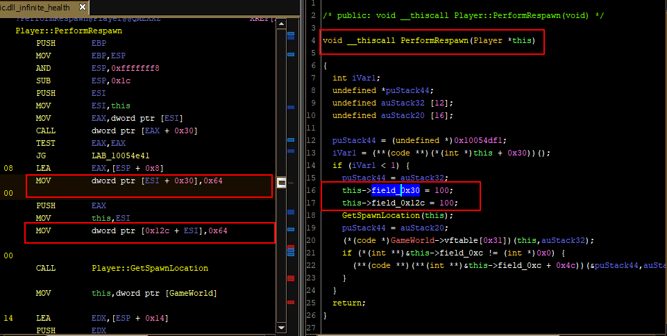
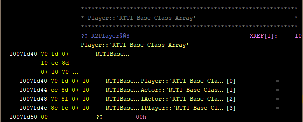
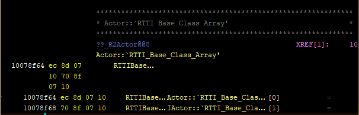
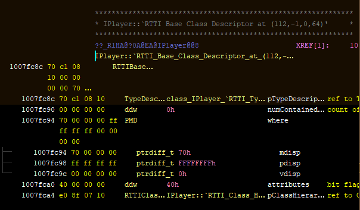
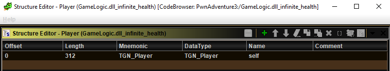
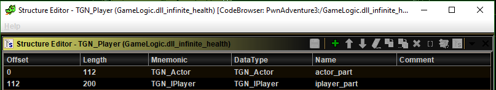
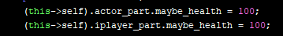
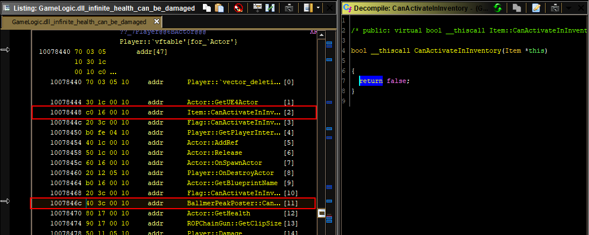
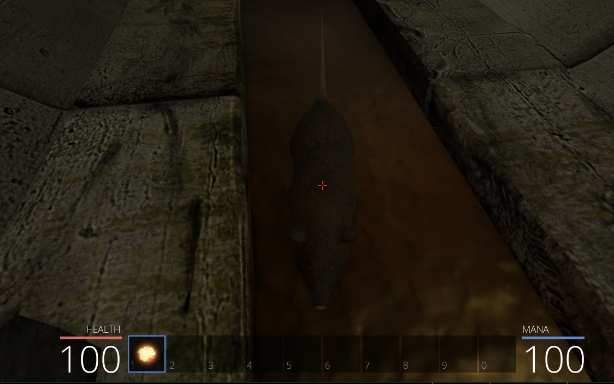
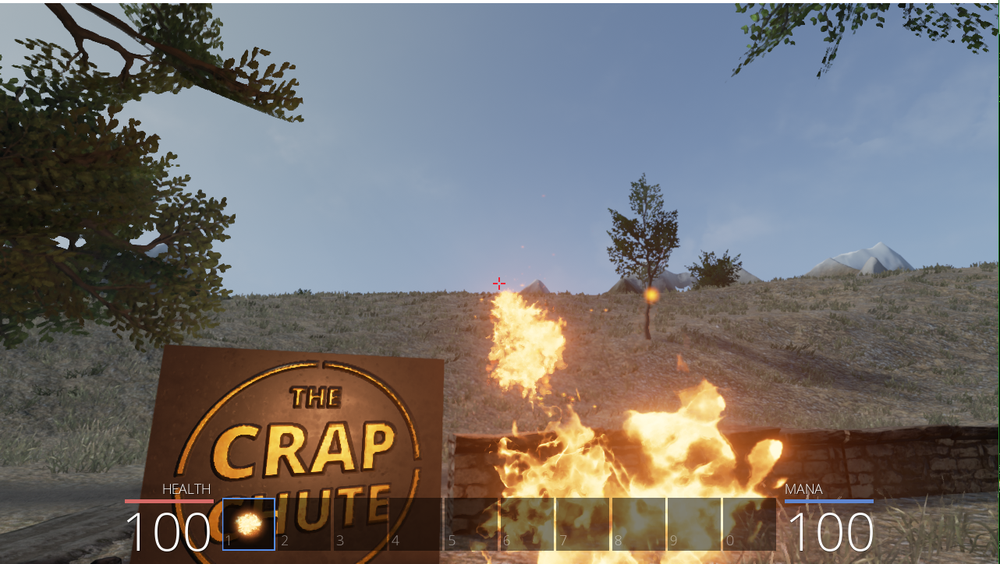

# A glamorous_noob meets Pwn Adevnture 3

## (4) Glamorous_noob and the philosopher's patch
### Contents
[I - TLDR](#i---tldr)

[II - Leads from last episode](#ii---leads-from-last-episode)

[III - *INSIDE* a `Player` instance](#iii---inside-a-player-instance)

[IV - Getting back to the immortality quest](#iv---getting-back-to-the-immortality-quest)

[V - Can you be damaged, sir?](#v---can-you-be-damaged-sir)

[VI - Bullying rats](#vi---bullying-rats)

[VII - Other possible patches to do the same thing](#vii---other-possible-patches-to-do-the-same-thing)

[VIII - Celebration](#viii---celebration)

------

### I - TLDR

- Make a copy of `GameLogic.dll` (as backup)
- Open it with a hex editor
- Go to offset  `0x7726c` 
- Write `c0 16` instead of `40 3c`, making the vftable's entry for `CanBeDamaged` point to a `return false` function instead of a `return true` function

### II - Leads from last episode

There were two leads from last episode: Searching for the scalar 100, and searching for other keywords like damage. The first lead made me find the `PerformRespawn` function of the `Player` class, and there I found two fields who might be health fields.



I had already guessed `Player`'s approximate size, but I hadn't worked on its structure at all. BACK TO RTTI structures! 

### III - *INSIDE* a `Player` instance

This here, is the RTTI base class array for the `Player` class. It's just an array containing all the base classes (or parent classes if you prefer) . Each entry contains a reference to a class's RTTI base class descriptor. The first entry is about the class itself (here `Player`), and the other entries are about its base classes. If you're not following at all this part, I dropped the link that taught me all this in episode 2. Go crazy [wink wink + shiny teeth smile].



So `Actor`, `IActor`, and `IPlayer` are all base classes for `Player`. The base class array of `Actor` shows only two classes: `Actor` itself and `IActor`. No `IPlayer`. And since I've been tinkering with this game for a couple of weeks now, I know that `Actor` is a common base class between the player and the enemies like those giant rats from the sewer.



What happens here is that `Player` has multiple inheritance. It inherits/is derived from `Actor`, who is in turn derived from `IActor`. It also, at the same time, inherits from `IPlayer`, a class that has nothing to do with the other two. And how this is implemented in a  `Player` instance will depend on the base class descriptor of each class. In the following screenshot, the `PMD.mdisp` field has the value `0x70=112`, which can also be seen in the comment generated by Ghidra at the beginning of the structure. This is the offset of the `IPlayer` class *inside* the `Player` class. 



I wanted to start editing the `Player`correspondingly, so I searched for the word "Player" in the data type manager and **GOD THERE ARE A LOT OF DATA TYPES IN THE RESULTS.** So I got this idea: I'll use the real type, `Player`, as just a wrapper for *my* type, `TGN_PLAYER`, like this:



That will make it easier to edit the `Player`type because it's easier to find `TGN_Player` and edit it instead. If I do the same thing for all the other types I manually worked on, I'll find them a lot easier by just typing "TGN" in the search bar of the data type manager.

Here's a screenshot of its structure that is supposed to represent what I got from the RTTI base class descriptors. The size of `iplayer_part` might not be exact but who cares. For now, it's enough.



### IV - Getting back to the immortality quest

Getting back to the matter at hand: **Infinite Health**. Here's the interesting bit of `PerformRespawn`, after editing the `Player` class and renaming both variables. Better, right?



Thanks to this, I can now look at other functions of the `Player` class and I will know if the health field is referenced at any time. I will also know which part of it is referenced. I later found that there was a `getHealth` function that returned the `maybe_health` field from `actor_part` which confirmed I was mostly on the right track structure-wise. Although to be honest, getting the structure right didn't help me for this patch. It did make me understand better how the game works, but that's it for now.

### V - Can you be damaged, sir?

The other lead was to look for the word "damage" in the symbol tree, and bingo: `CanBeDamaged` at `0x10003c40` is a function that returns `true`. It is referenced in the vftables of *many many many* classes, including one of the vftables of `Player` (11th function counting from 0), but it also referenced by a lot of enemies that I would really like to damage. Logically, changing the function's return value was out of the question.

*What I **could** do though*, is to change the entry in the vftable. An entry in a vftable contains an address to a function. Some code will call `player_instance_pointer->vftable[11]` at some point, and based on the return value it will decide whether this `Player` instance can be damaged or not. For now, this vftable entry contains an address to a function that always returns `true`. If I can replace that address by that of another function that always returns `false` it will be a win!

And theeeeere it iiiiiis: the `return false` function, which happens to be the entry number 2 (counting from 0) in the same vftable: 



All I had to do then was replace the `40 3c` at `0x1007846c` by `c0 16` for the address to be identical to the one at `0x10078448`. The actual patching of the binary was done like in the previous episode with a hex editor, for the same reasons  also explained in the previous episode.

I wanted to add a label at the address of the patch but I couldn't do it at first. The contextual menu of Ghidra (the one you get when you right click) doesn't show a "create label" option inside the array. Pressing "L" suggests editing the function's name which is definitely not what I want. So I summoned my python skills and executed this, with cursor at the address of the patch:

```python
currentProgram.getSymbolTable().createLabel(currentAddress, "TGN_PATCH_canbedamaged", ghidra.program.model.symbol.SourceType.USER_DEFINED)
```

It worked.

### VI - Bullying rats



I went to the sewer to test out my patch and just stood there in front of one of the rats, and it started attacking me. MEEEE! But since I had obtained immortality through my philosopher's patch, it didn't really matter. Only my pride was hurt. So I killed the rat, naturally. I even got "Pwn Coins"! Yaay!

### VII - Other possible patches to do the same thing

Another function that piqued my interest was `Player.Damage()`. This function does a bunch of things, and then calls `Actor.Damage()`. What I wanted to do is to `NOP` that call, which I did. But the moment that Giant Rat attacked me the game crashed. I tested this twice, same result.

My guess is that, since the function has `this call` as a calling convention, the callee (the called function) is the one that should clean its stack. So if I just `NOP` the call, no one cleans the stack by popping the function arguments, but the caller (the calling function) expects it to be cleaned and uses the stack based on that assumption, so at some point it segfaults by going to the wrong address or something.

Here are the fixes I could think of:

- Modifying the address of the called function, and put the address of its `RET 0x10` instruction which just cleans 4 stack arguments.
- `NOP`ing the `PUSH` instructions, not just the `CALL` part
- Overwriting the `CALL`instructions with 4 `POP` instructions or 1 `SUB %ESP, 0x10%` and fill the rest of the bytes with `NOP`

I tested the first fix and it worked. I didn't test the other two. All the patches I make and test will be available in `apply_patches.py` in the root directory of this project.

### VIII - Celebration



That's a picture of me celebrating my infinite health and infinite mana, after getting out safely from the crap chute. I officially declare my first objective complete. I am happy AF because I had no idea I'd be able to do it when I suggested it. Taking risks is fun. Anyway, I need a second objective so I will just play the game a little bit and see where it leads me.

Maybe I'll try this "auto-aim" thing I wanted but I'm not really sure how to do that and I'm not sure I really need it now that I have infinite mana and health. Anyway, we'll see!

---------

Thanks for reading this far! Here's an internationally-recognized definition of **IMMORTALITY** for you.

> **Immortality** is the magical ability to live forever. Immortality is one of the known limits to [magic](https://harrypotter.fandom.com/wiki/Magic); it is nearly impossible to make oneself immortal; the only known and working ways are making and using a mystical object of great power to sustain life (such as the [Philosopher's Stone](https://harrypotter.fandom.com/wiki/Philosopher's_Stone) created by [Nicolas Flamel](https://harrypotter.fandom.com/wiki/Nicolas_Flamel) or the [Philosopher's Patch](https://github.com/glamorous-noob/pwn_adventure_3/tree/master/Episode_04-Glamorous_noob_and_the_philosophers_patch) created by [glamorous_noob](https://github.com/glamorous-noob)).

