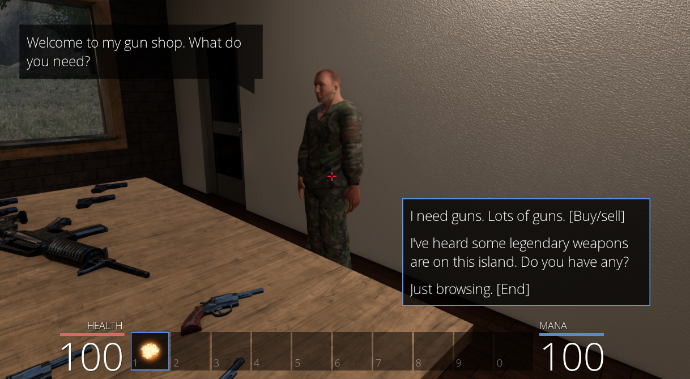
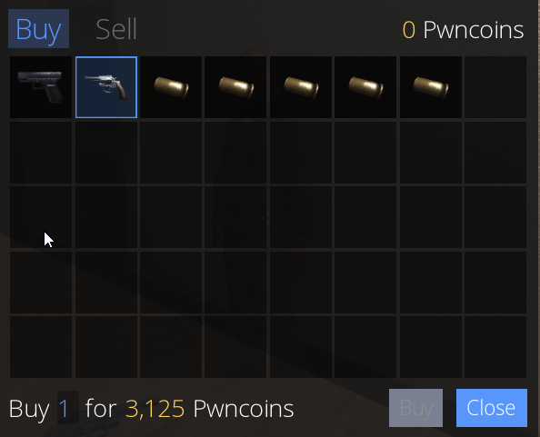
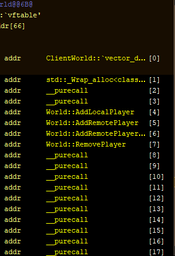
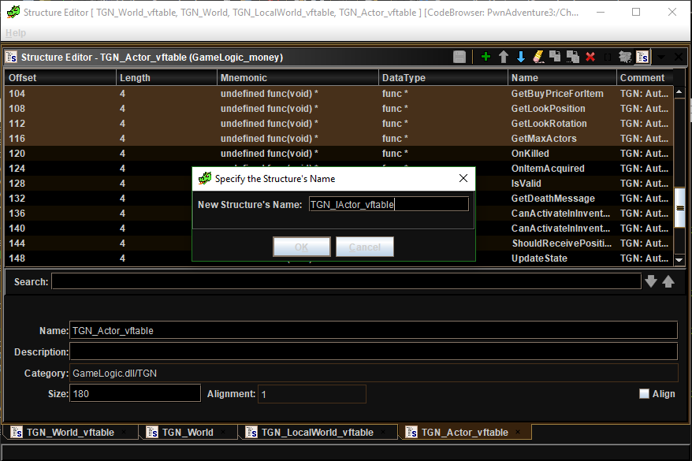
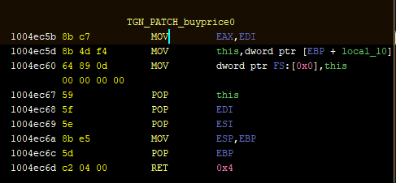
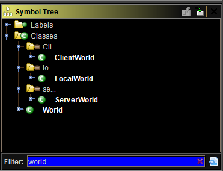
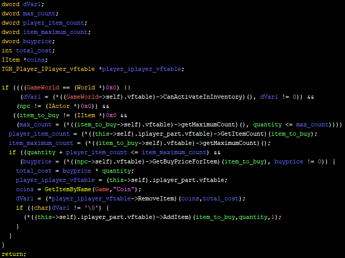
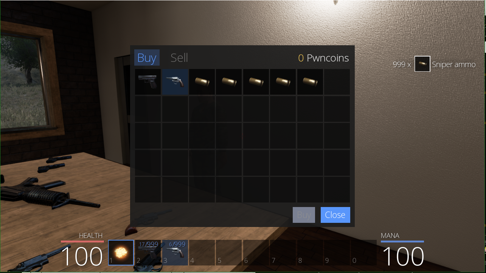
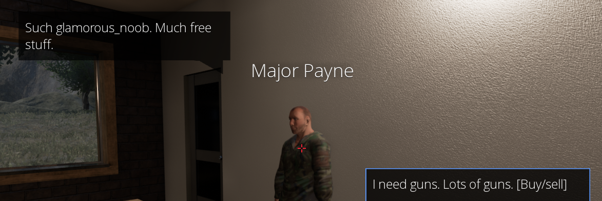

# A glamorous_noob meets Pwn Adevnture 3

## (5) Ultimate shop discount
### Contents
[I - TLDR](#i---tldr)

[II - Civilization!](#ii---civilization)

[III - Reinforcing my technical raypertwaaar](#iii---reinforcing-my-technical-raypertwaaar)

[IV - Existential crisis](#iv---existential-crisis)

[V - Charismatic noob](#v---charismatic-noob)

[VI - Money problems](#vi---money-problems)

------

### I - TLDR

Me learn new Ghidra techniques for manipulate virtual functions.

Me do patch for free stuff in shops. Me code patch as `buy_price_item_always_0` in `apply_patches.py`.

Next episode much money.

### II - Civilization!

Last episode ended with me getting out of the crap chute with infinite health and mana. My exploration of the island thus began! I headed to the right and explored a little. I found two buildings, one underground area for fast travel, and one weird castle with puzzles. I'm gonna leave the part where I explored every one of those for later episodes and only talk about the first building for now: THE GUN SHOP!

The gentleman you see her is Major Payne (I love the puns in this game). If you tell him you want to buy guns, you'll see this window:

Which leads to the following question, "*Can I, like, buy thaaat, but, without, like, having to pay any moneyyyy?*" (read that with a Valley Girl accent)

And that, my friends, is the topic of this episode. By reading this last sentence you became officially my friend. You can't get out of that now.

### III - Reinforcing my technical raypertwaaar 

Before getting around to this episode's hack, I'll mention a couple of things in order to get them out of the way and avoid needing to talk about them every time I use them. It's about two techniques I didn't use at all before, but started using extensively while working on this episode.

#### Creating vftable types

I developed the `create_vftable_type.py` script . The idea is to easily change the decompiler's output from `*(objectRef->vftable[5])()` to `*(objectRef->vftable->NameOf5thFunctionInVftable)()` without suffering much (searching for stuff and renaming fields manually = suffering).

So my script does a bunch of stuff to achieve this and it's explained in more detail in the `Ghidra_scripts` folder's `README.md`. It has screenshots and shit.

#### Manually refactoring vftable types

I got this idea after using the previous script on an abstract class. Its vftable looked like this:

If you don't understand the sorcery behind this you might want to [[follow this link]](https://en.cppreference.com/w/cpp/language/abstract_class) and also [[this one]](https://www.geeksforgeeks.org/pure-virtual-functions-and-abstract-classes) for starters.

After C++ code is compiled, virtual function calls are made by dereferencing the corresponding entry in the vftable knowing its index. It kinda makes sense (yup, that's my guesswork, that's not facts) for inherited virtual functions to have the same indexes across the vftables of different classes, otherwise [dynamic binding](#https://en.wikipedia.org/wiki/Late_binding) would be an absolute mess. If:

- that guess is true
- we have two classes, base class `LifeForm` and derived class `GlamorousNoob`
- `LifeForm`'s vftable contains `n` entries

then it's safe to assume that the first `n` entries of both classes' vftables would share the same names and *probably-but-not-definitely* different implementations.

In Ghidra, you can define a struct type by choosing multiple fields of another struct type and clicking on the "s" icon at the top right corner of the Structure Editor. One can simply use this technique in a vftable type of a derived class in order to create the vftable type of the base class.

### IV - Existential crisis

What do I want? What kind of noob am I? Am I the kind of noob so charismatic that they get everything for free wherever they go? Or am I more of a wealthy noob who can always afford everything in the game's universe? Can I be both? What if I walk the charisma path and later I encounter a quest that expects me to have a certain sum of PwnCoins to validate it? Etc.

I overthought this whole thing a little bit and I decided to just make the two patches. First I'm going to try and make everything free in shops. Then I'll try to just start the game with the maximum amount of money and make sure it never decreases, without manipulating prices in shops. If I want to use one patch and not the other or use both, it's easy to do with my `apply_patches.py`.

A third option was based on the `Buy` button. It gets greyed out when you can't buy an item, so I assumed it uses a " `canBuyItem`-style" function. I could imagine a patch where the button always allows the buy operation, and where the buy function does no checks and just puts the shop item in the inventory without any payment. But I had no clue where the button was and I couldn't find any `canBuyItem`-style function. Although to be fair, I didn't look that much.

### V - Charismatic noob

Last episode, one of the patches was based on the `CanBeDamaged` function. So an intuitive way to approach the "buy stuff for free" quest is to look for an equivalent function that's related to prices. And sure enough, there's a function called `GetBuyPriceForItem` in the vftable of `NPC`. When you look at the function you see that there is only one `RET` instruction, and that it's preceded by a `MOV EAX, EDI`. Here's a pic:

First thought was to make it a `MOV EAX, 0`, but this patch needed at least 5 bytes and it didn't fit in the measly 2 bytes reserved for this instruction.

So I went with `XOR EAX, EAX` that fits exactly in the said measly 2 bytes.

I tested that. It half-worked. The prices were all 0 in the shop and the `Buy` button was enabled but clicking on it didn't buy me anything. I searched for more functions related to buying stuff and I found `BuyItem` in the vftable of `Player` for `IPlayer`. It called `GameWorld`'s (the singleton world object) `BuyItem`. Soo there are actually a few "world" classes.

`World` seems to be the abstract class, and the 3 other classes seem to be derived from it. Since for now I'm testing only the offline mode, I'd say I play in the `LocalWorld`. `LocalWorld.BuyItem()` just calls `Player.PerformBuyItem()`. Here's the said function after I've graced it with my glamorous touch (you know, using my technical raypertwaaar)

If you look closely to the variables and function calls you'll understand why my patch didn't work. Look at what happens after the call to `GetBuyPriceForItem`. Yaaassss it's as simple as that. It was just a `JZ` instruction which I `NOP`'d and things worked after that. 

If you find my explanation's not detailed enough, I encourage you to check out previous episodes where I explain in detail how I did similar patches :)

And just for fun (and asserting dominance), I changed Major Payne's greeting. Charisma achieved.

### VI - Money problems

I thought becoming wealthy in this game would be a bit straightforward seeing how straightforward things were so far, but nope. I kinda got lost for several days again. On one hand because I got so distracted with all of the new classes and the many things I could try to do with them (and probably fail). On the other hand, I couldn't easily find explicit parts of the code that told me where money was stored.

> Preposterous! What about the two lines of code in the function you just patched in which you literally renamed a variable yourself to "coins"? YOU SHOULD QUIT REVERSE ENGINEERING FOREVAAAA!
>
> ~Random Antagonist

> I hear you, antagonist shit person that I just invented for story-telling purposes. There was a time when I was as naive as your non-glamorous self. You will have to read the next episode if you want to learn the error of your ways.
>
> ~Their Glamorous Noobness

In the next episode I'll try to do the infinite money patch. I might also debate with the random antagonist, in which case I'll win. Because let's face it, that's the only reason I'd invent an antagonist.

--------------

Here's a fun story for you that I just remembered,  as a "thank you for reading and bearing with my weird shit so far":

When I was less than 5 years old, I used to cry whenever I lost at video games. I devised this genius plan where I play in two-player-versus mode against no one, just a controller with no player. I still lost. Yup.
