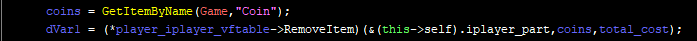
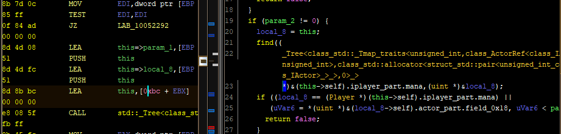
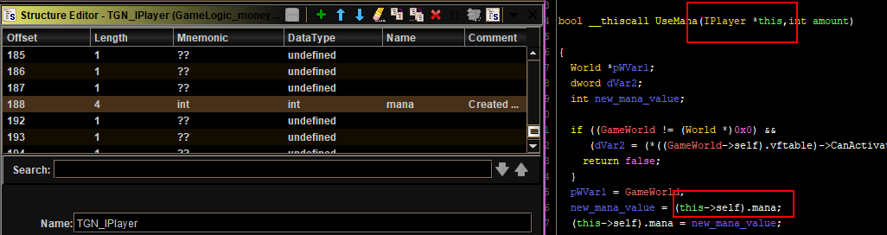
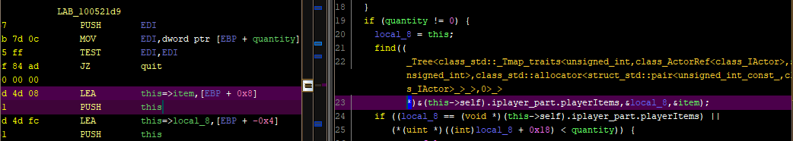
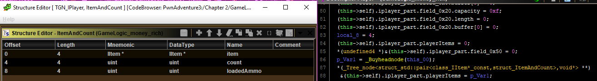
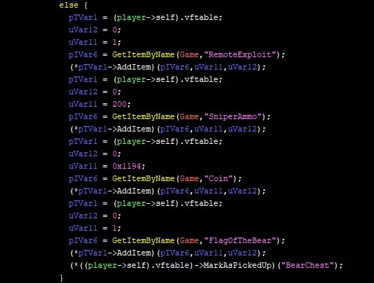
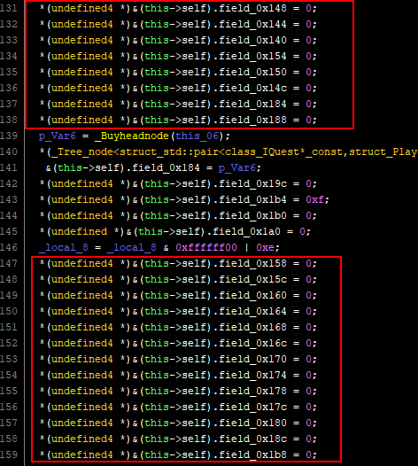
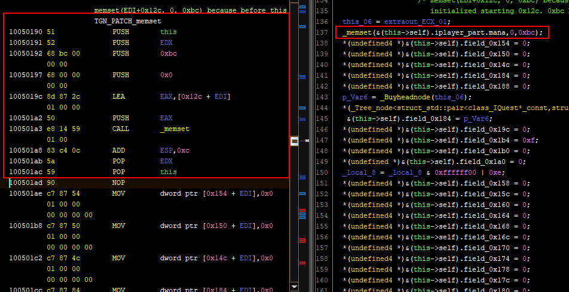
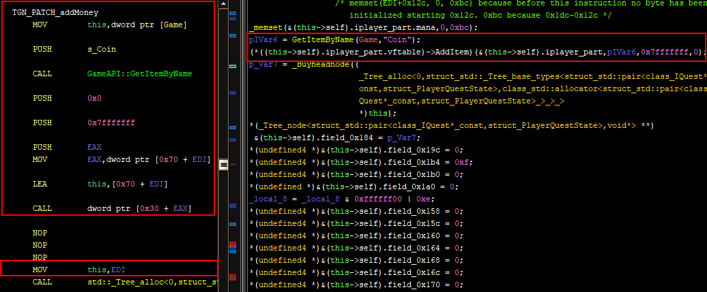

# A glamorous_noob meets Pwn Adventure 3

## (6) Still poor AF
### Contents
[I - TLDR](#i---tldr)

[II - Intro](#ii---intro)

[III - Nooby trap 1 : Subtracting offset from `this`](#iii---nooby-trap-1--subtracting-offset-from-this)

[IV - Nooby trap 2 : Mana referenced in `PerformRemoveItem`](#iv---nooby-trap-2--mana-referenced-in-performremoveitem)

[V - False lead:  Quantity of  `IItem`](#v---false-lead--quantity-of--iitem)

[VI- Solution: Looking for "Coin" references](#vi--solution-looking-for-coin-references)

[VII - Patch: Making room](#vii---patch-making-room)

[VIII - Patch: Supposedly adding coins](#viii---patch-supposedly-adding-coins)

[IX - What next](#ix---what-next)

------

### I - TLDR

I come across what looks related to casting and polymorphism to me when examining calls of virtual functions in a class with multiple inheritance.

I run into exactly the same thing again but differently. Same but different. Yes.

I figure out how coins are implemented and added to a player (more complex than last episodes) and I do a magnificent yet non functional patch. Sad.

### II - Intro

We left off at the two lines below in the `Player.PerformBuyItem()` function while looking for a way to make the player start off with a big amount of money and making it never decrease throughout the game.

```c
coins = GetItemByName (Game, "Coin");
(*player_iplayer_vftable->RemoveItem) (coins, total_cost);
```

On one hand, YES, it is easy to just `NOP` the call to `RemoveItem` so no money is paid whatever the price is. BUT, on the other hand, if the player doesn't have enough money in the first place, the "Buy"  button won't be enabled and the buy will never happen. There aren't any functions that are very obviously named like "hasEnoughMoney" for example and I don't know how to find the "Buy" button. I went with the idea of just having lots and lots of money at the start of the game so I couldn't care less about the button.

This episode is mostly about why achieving this was difficult for me and the technical stuff I've learned from it (yay me, yay growth).

### III - Nooby trap 1 : Subtracting offset from `this`

First lead? The `RemoveItem` function:


Look at this `RemoveItem` function. WTF is happening in that `PerformRemoveItem` call? The first argument here is supposed to be `this` and it should be passed through the `ECX` register (see [this link](https://en.wikipedia.org/wiki/X86_calling_conventions#thiscall) if not familiar with ` __thiscall`). Here's how it looks in assembly:

```assembly
PUSH     dword ptr [EBP + param_2] ; push param_2 as a stack argument
LEA      ECX,[EDI + -0x70] ; put the address of (this-0x70) in ECX
PUSH     dword ptr [EBP + param_1] ; push param_1 as a stack argument
CALL     0x100521c0 ; call PerformRemoveItem with whatever in ECX as the address of "this"
```

Knowing that `EDI` contained the `this` reference, the second instruction above seemed weird AF. It's always been `this+something` and never `this-something`. And how would the decompiler think that subtracting `0x70` is actually advancing inside the structure?

After going back and forth between functions I understood what was happening in part. Here's my attempt at explaining this with a diagram. It will also serve as a demonstration of how bad I would be as an ASCII artist.

```
    Player instance                    address of instance of IPlayer or one of its derived classes
     ____________ Actor Part at @a                                   ↓↓
    |            |                                                   ↓↓ this
    |            |                                      __________________________________
    |____________| IPlayer Part at @a+x70                  IPlayer virtual function (vf)		  
    |            |                                      __________________________________
    |            |
    |____________|
Each part starts with a vftable               vf is allowed to have a different    
address + a bunch of attributes               implementation for every class but
following the model of the                    it has to keep the same signature 
corresponding base class                      across classes to ensure polymorphism
```

We're talking about a `Player`'s implementation of an `IPlayer` virtual function (`RemoveItem`). The `IPlayer` part inside a `Player` instance starts at `0x70`, as analyzed in previous episodes. See where this is going? The `RemoveItem` function was actually called like this (assume that `EBX` contains the `this` reference):

```assembly
MOV      ESI,dword ptr [EBX + 0x70] ; put the dword at this+0x70 in ESI (address of IPlayer vftable)
LEA      ECX,[EBX + 0x70] ; put the address of (this+0x70) in ECX (address of IPlayer part)
MOV      EAX,dword ptr [ESI + 0x34] ; put (vtable+0x34) in EAX (address of RemoveItem)
CALL     EAX ; call RemoveItem
```

So what was passed as `this` through `ECX` for `RemoveItem` was **<u>NOT</u>** the address of the `Player` instance, but instead, the address of the `IPlayer` part inside of said instance. **THAT'S UPCASTING!** And the thing that happened inside the `RemoveItem` where the `0x70` were subtracted again, that must be downcasting! Such revelation, much knowledge. As usual, here are a couple of links: [casting in C++](https://www.tutorialcup.com/cplusplus/upcasting-downcasting.htm), and [casting in java if you prefer the Java syntax (I do honestly))](https://www.codejava.net/java-core/the-java-language/what-is-upcasting-and-downcasting-in-java). I feel the need to note the following points before the imaginary random antagonist from last episode butts in:

- The Java syntax link is there only to explain the concepts of casting in OOP, knowing fully well that Java code is not compiled to x86 assembly like C++ is.
- I think the only reason the casting in this situation was so "tangible" is because of the multiple inheritance. If a class has only one base class it will have only one vftable, and as far as I can imagine, there would be no need to add/subtract offsets.
- At the assembly or even at the decompiled C level, the `this` reference and its type are part of the function's signature, which is not the case in C++ code.  That's why speaking about function signatures, polymorphism, and casting in this context might seem confusing. For the record, I'm not sure it's absolutely 100% technically correct to use the words "upcasting" and "downcasting" as I did in this context but they do seem appropriate to me.

Btw, it would've been easier to spot if I had correctly typed the `RemoveItem` field in the vftable type for `IPlayer` with the correct calling convention `__thiscall`. I would've seen the `this` parameter being passed as `&(this->self).iplayer_part` instead of just `this`. It has been taken care of, but only a few minutes before uploading this file.



### IV - Nooby trap 2 : Mana referenced in `PerformRemoveItem`

Right after understanding the subtracted offset issue, another shit defiantly popped up as I started looking into `PerformRemoveItem`:



WHY IS MANA HERE? This is the field I named "mana" in the 3rd episode because it was decremented in the `useMana` function, and by *not* decrementing it I got the infinite mana. So I was definitely right, and yet, I seem terribly wrong here. 

Aaaaaand it IS actually the same issue as the one before. You see, `useMana()` is a virtual function from `IPlayer`, which means that any `this+offset` inside that function is actually referring to the field at `offset` inside `IPlayer` and not `Player`. On the other hand, the `PerformRemoveItem` function *really* did get an address to a `Player` instance so we're not talking about the same fields here.

Long story short, I went to `useMana`, retyped its `this` from `Player` to `IPlayer`, named the field at `0xbc` in `IPlayer` as "mana", and renamed the field used in `PerformRemoveItem` (`0xbc` in `Player`, `0xbc-0x70=0x4c` in `IPlayer`) from "mana" to "playerItems".



### V - False lead:  Quantity of  `IItem`

I edited the signature of `find` (compare screenshot below to 2nd screenshot above) to add one more argument based on the push instructions just before and then checked the code of the `find` function itself to see that it did access the stack parameter area and that it made sense.



I tried to look up what this `find` function might be in order to know the type of  `playerItems` and its size. While [this documentation](https://www.geeksforgeeks.org/std-find-in-cpp/) seemed interesting, I didn't really feel it fit with what I had here. For one, the link talks about `std::find` but here I see a `playerItems.find`. The order of the parameters didn't feel right either and nothing suggested iterators in this portion of code. It just seemed like the found item is returned in the second argument (first stack argument, `local_8` in the screenshot).

"*Screw the find documentation. Screw that `playerItems` format. Just figure out the format of an `IItem` so you can forge money!*" whispered Their Glamorous Noobness to themself, in a weakened Voldemort at the back of Quirrell's head fashion.

So, I followed my disturbingly cranky thought and considered the second argument (`local_8`, which I later renamed) to be the found item. Which would mean that the quantity of an item is stored at offset `0x18`  according to the if statement in the screenshot. So as usual, I created a custom type for `IItem` with the `count` field at offset `0x18`.

The next goal was to find where the money item is created and modify the count during initialization. The `Player` constructor seemed like a legitimate place to look for that but **PLOT TWIST** it mostly just confused me. Here's why:



I usually ignore the c++ demangled gibberish, but this one time I read it in the line 87 and noticed `ItemAndCount`. It appears to be an existing type, which I have not defined, that has an `IItem` reference + its count. I didn't like this crap because it's making me question all of my progress on this matter so far (it seems little but it took days). I thought the count was in the `IItem` itself.

This frustration aside, the `_Buyheadnode` bit was pretty cool. It took one  web search to find links for the `xtree` implementation in c++ on GitHub. It looks like an implementation of a red-black tree. The relevant part to know in our context is that it is a data structure optimized for finding stuff, it is used for implementing maps / sets, and it's accessible via its root (head node) to which a reference is kept somewhere. I learned said stuff from algorithms classes in university + some web searches. The `playerItems` field seems to keep a reference to this `xtree` that keeps track of items. And now, the `playerItems.find` function makes sense: it's asking the tree to put a reference of the node containing the item in the local variable. 

Bottom line is, it's sure now that `playerItems` is just a 4-byte field because it's only keeping a reference to the head node.

Also, no reference to the "Coin" string was made whatsoever inside the `Player` constructor. The items tree was created but it was left empty. I had to look for other leads.

### VI- Solution: Looking for "Coin" references

**Thought:** In the `PerformButItem` there was this `coins = GetItemByName (Game, "Coin");` line. Maybe It is used whenever money is involved.

**Action:** Looking for all the "Coin" string references. Getting lost in shady functions without any ounce of progress before finally finding inspiration.

It's really no use getting into the different dead-ends I hit and this episode is already long as is. So here's the nice piece of code. (I wrote that sentence when I thought this solution would work. Ha.)

```C
pTVar1 = (player->self).vftable;
uVar12 = 0;
uVar11 = 0x1194;
pIVar6 = GetItemByName(Game,"Coin");
(*pTVar1->AddItem)(pIVar6,uVar11,uVar12);           
```

And here it is in Ghidra's assembly view (after slight modifications)

```assembly
MOV        ECX,dword ptr [Game] # Put the reference of the global Game object in ECX (this)
MOV        ESI,dword ptr [EDI] # EDI contains the IPlayer object, put its vftable in ESI
PUSH       0x0
PUSH       0x1194
PUSH       s_Coin
CALL       GameAPI::GetItemByName # Call Game.getItemByName("Coin")
PUSH       EAX # push the result (item) which is an IItem to the stack
MOV        ECX,EDI # Put the IPlayer instance (let's call it player) in ECX (this)
CALL       dword ptr [ESI + 0x30] #AddItem at 0x30 in the vftable. player.AddItem(item, 0x1194, 0x0). 
```
This code was in some few `PerformUse` functions belonging to a `SomethingChest` class every time. It seemed like opening a loot chest that gave rewards, including coins. Here's an example: `BearChest.PerformUse`.



And I thought, if coins are stored in a tree, which is dynamically allocated across the game, I'm better off just calling the get-item-add-item duo somewhere than trying to modify a field as I previously imagined.

### VII - Patch: Making room

**Hypothesis #1:** I need for my player to have a maximum amount of coins at creation. If I want to call the previous sequence I have to do it in the `Player` constructor or in the `InitLocal` function which calls it.

**Hypothesis #2:** This episode's patch is different from those before in the way that it will need several assembly lines and not just one or two. I need to find that space of overwritable instructions, especially because I'm sadly unaware of a working way to just add a memory block containing my own function and update the binary's metadata to include it.

**Hypothesis #3:** The `Player` constructor is a pretty long function where the `0x1dc` bytes of the `Player` instance are manually initialized. Most of them are initialized to 0.

**Idea:** If I could shove a `memset` call at the beginning of the constructor, I can consider any other following instruction initializing a field to 0 to be overwritable, and THUS making room for my patch. (see how I used "thus"?)



For instance, one could replace the first block of `MOV` instructions giving the lines from 131 to 138 with a `memset` call, rendering the instructions of the lines 147 to 159 redundant and overwritable.



Here's the `memset` call. The first 2 `PUSH` along with the 2 `POP` instructions are just for [register preservation](https://en.wikipedia.org/wiki/X86_calling_conventions#Register_preservation). The rest is about giving 3 stack arguments to `memset`, calling it, and then cleaning the stack by modifying `ESP`. I chose the `0x12c` offset in the `Player` instance because at execution time this will be the smallest offset that hasn't been initialized yet. The value `0xbc` is just the number of bytes to be set to 0 seeing that the total size of the instance is `0x1dc` (`0x1dc-0x12c`). With this, I am able to overwrite any instruction setting a field to 0, as long as the field has an offset equal to or greater than `0x12c`.

### VIII - Patch: Supposedly adding coins

Call me greedy, but I managed to fit the the money patch right after the `memset` call and not a few C lines worth of instructions later as I first imagined. The patch modifies the contents of `EAX` and `ECX` as a side-effect which could in theory screw with the execution of later code. After checking, the contents of `EAX` are never used before being overwritten by the original code itself when `_Buyheadnode` is called. As for `ECX`, a quick read of the assembly code shows that a `MOV ECX, EDI` after the patch and before the next function call should make everything back to normal. A cleaner way would be pushing to the stack before the patch and popping after but, as my French friends would say, "flemme".



And below, is an illustration of what failure looks like.


### IX - What next

The patch didn't work. Either the idea is solid but the execution was sloppy, or the idea isn't working. For instance, maybe the `getItemByName("Coin")` returns 0 because the items in the game aren't initialized yet by the time the player is created and my patch is executed. Maybe I should trigger my patch later in the game? Maybe link it to an action I can easily do?

Aside from the money issue, there are a lot of things I would like to achieve like walking faster, or 1 shot 1 kill, etc.

In all cases, I think that this episode really represents a lot of the reasons I decided to do this whole write-up, so it's pretty cool overall.

----------

MADA MADA DESU! FAITOOOO!

