# A glamorous_noob meets Pwn Adventure 3

## (7)  Get rich (and) fast!
### Contents
[I - TLDR](#i---tldr)

[II - Previously on](#ii---previously-on)

[III - The plan](#iii---the-plan)

[IV - The execution](#iv---the-execution)

[V - The plot twist](#v---the-plot-twist)

[VI - The triumph](#vi---the-triumph)

[VII - Bonuses](#vii---bonuses)

------

### I - TLDR

Adapted last episode's patch to get max amount of coins when the Great Balls of Fire spell is fired.

It didn't work. Found error related to dll relocation. Made it work.

Fixed same error in last episode's patch, but crashed consistently on player creation. Got the idea it's too early to add items at this stage of game initialization.

Bonus patches: increasing walking and jumping speed, and sudden death mode.

technical raypertwaaar bonus: basic strings and their structure 

### II - Previously on 

I made a patch meaning to add the maximum amount of money to the `Player` on creation. It did not work. It sometimes even crashed the whole game. My patch being just a duplication of already existing code elsewhere in the game, I was pretty sure I didn't mess up anything instructions-and-stack-wise.

I conjured up *Rokku Rī* 's spirit and thought to test the same patch, but trigger it *after* everything's been initialized i.e. when I'm already in the game. Firing the "Great Balls of Fire" spell seemed like a nice trigger.

### III - The plan

Here's how I imagined I'd adapt my previous patch

```
Player constructor before         Player constructor after
 -----------------                 -----------------
| blablabalaaa    |               | blablabalaaa    |
| yadayadayada    |               | yadayadayada    |                 ZEU TCHOSÈNE TRIGUEUR
| code code code  |               | code code code  |                  -----------------
| MEMSET PATCH    |               | MEMSET PATCH    |                 |     do stuff    |
| MEMSET PATCH    |               | MEMSET PATCH    |              v-<|     JMP         |
| MEMSET PATCH    |               | MEMSET PATCH    |              |  |  do other stuff |<-<
| MONEY PATCH     |               | JMP             |>--v          |   -----------------   |
| MONEY PATCH     |               | MONEY PATCH     |<--|----------<                       |
| MONEY PATCH     |               | JMP             |>--|----------------------------------^
| more code code  |               | more code code  |<--<
| yadayadayada    |               | yadayadayada    |
| blablabalaaa    |               | blablabalaaa    |
 -----------------                 -----------------
 
Instead of the money patch executing right after the memset patch, a JMP instruction is inserted between the two patches so the money patch will skipped.
Later, another function used as a trigger will jump to the money patch, and the money patch will be adapted to jump back to it.
```

The only thing that changes for the memset patch is a `JMP` instruction. Here's the patch before.

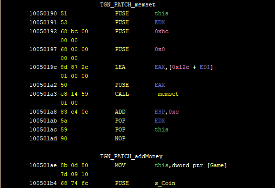

And here's the patch after.

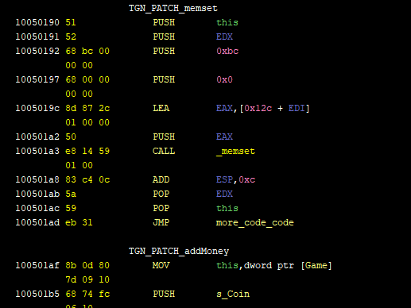

The money patch got shifted to make place for the extra byte in the patch size. 

### IV - The execution

Now what I needed was to find a good trigger. I remembered the name of a function I saw a lot in the decompiler window and the vftables during last episodes but I'd never really paid attention to it: `CanActivateInInvetory`. I guessed the word "activate" is the one to be used when firing a spell, and after searching a little bit in the symbols I found `GreatBallsOfFire::PerformActivate`. After doing the usual for the GreatBallOfFire class type and its vftable, it gives this. (Note that the second argument to `SpawnProjectile` is Ghidra's decompiler's weird way of saying `IPlayer ref - 0x70`)

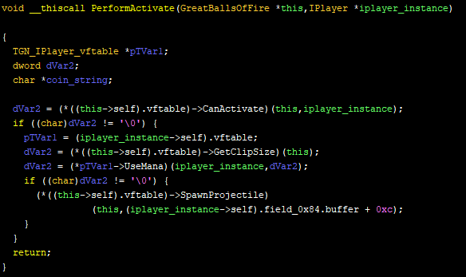

And to be honest, I didn't want to ruin any of the function calls, even `useMana`, to do my patch. I wanted to do it in the least intrusive way possible. And to my luck it was veeery much possible in this particular function because of this screenshot here:

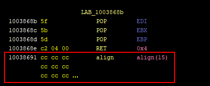

This portion of code is at the end of the `PerformActivate` function. First 4 instructions are nothing special: they are basically recovering registers, returning, and cleaning the stack. The `align(15)` instruction however which I usually ignore seemed to be exactly what I was looking for.

If I got it correctly, processors access addresses more easily if they are aligned to a certain number of bytes (usually a power of 2), i.e. it's cool when addresses are a multiple of said 2, 4 or 8 or whatever. The actual number of bytes determining the alignment is platform-specific. So what the compiler seems to have done to this function is:

- It compiled the function and gave it an address that makes it 16-byte aligned (`0x10038650`, not in the screenshots)
- It saw that the function instructions ended at `0x10038690`, which would make the next function definition start at `0x1003891`, an address that is 1-byte aligned (so basically not aligned), and thought "Unacceptable!"
- Added 15 bytes of padding so that the next function starts at `0x100386a0`. The actual instruction these padding bytes translate to is a [software interrupt](https://en.wikipedia.org/wiki/INT_(x86_instruction)). They should never be executed anyway seeing they have a return instruction just before.

WHICH MEANS: I have 15 whole bytes to patch without affecting AT ALL the original function's instructions.

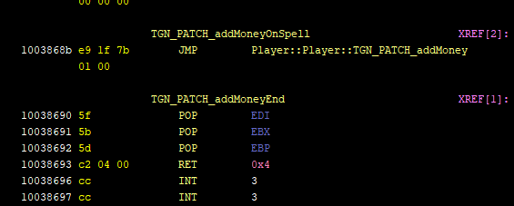

Notice the addresses: I just shifted the original instructions 5 bytes down to make place for my `JMP` instruction which I placed at their original address, `0x1003868b`. I couldn't make the remaining 10 padding bytes appear as `align(10)` in Ghidra but it really doesn't change anything. Now the final step was to adapt my money patch. Here's how it looked before:

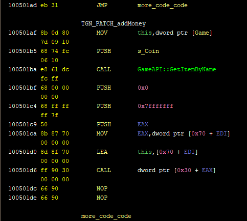

It used `EDI` hoping to find an `IPlayer` reference in `EDI+0x70`, and it overwrote contents in  `EAX` and `ECX` (shown as "this" in the above screenshot). Looking back at `GreatBallsOfFire::PerformActivate` though, I find it had its `IPlayer` reference directly in `EBX`. The patch needs to receive `IPlayer` through `EBX`, which is great because it will reduce the patch size. It will also need to save `ECX` and `EAX` to the stack and recover them later, and then `JMP` back to the calling function. You can see the modified parts in the red rectangles.

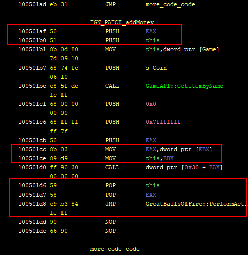

And it gives this very nice decompiled code suggesting I did it!

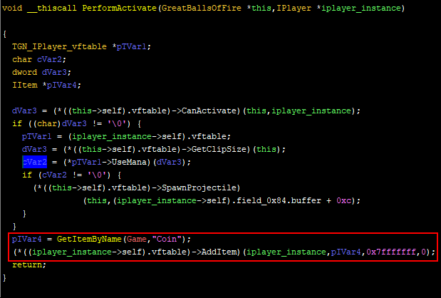

But I didn't. It crashed. It kept crashing differently every time I tried.

### V - The plot twist

In the state of not having any idea about why it would not work, I used a debugger (x64dbg) to see what was happening at run-time. And here's the thing, The addresses were all wrong. For starters, the virtual addresses were different (left column), but the addresses I coded manually in my patch stayed the same. These were absolute addresses pointing to the Game API instance and the "Coin" string, both needed for the `getItemByName` call.

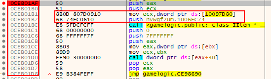

Out of curiosity I checked out where the "Coin" string was, and it had a completely different address than the one coded in my patch.

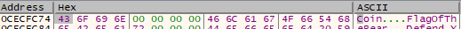

I was already aware of the fact that these [addresses are virtual](https://en.wikipedia.org/wiki/Virtual_address_space) blablabla but I never actually thought about how strings and global variables are referenced in that context. `CALL` instructions can use relative addresses, same for `JMP` instructions, so they're off the hook. But logically, if without my patch the program functions well, then that means it manages somehow to reference the Game API instance and the "Coin" string correctly. And sure enough, it does. Below is a screenshot of the `PerformUse` function on which I based my patch. It does push the updated address of `Coin` instead of the one coded in the `.dll` file.

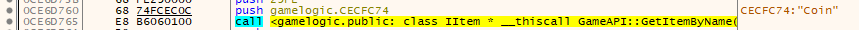

Sooo how does it? I know for a fact it used the same address I used in my patch in the `.dll` file. So something updated it and updated all the other addresses, but not the ones I put manually. All of this led to researching stuff, leading to [this link](https://stackoverflow.com/questions/10970472/is-it-possible-for-function-address-in-dll-to-change-if-it-loaded-to-application?fbclid=IwAR2qCQbtGAo-dRUo8xYjyXglhkuMKhjqhTGhuFXSeCQsNxuLp0IZDkKgEYg) and [this one](https://www.drdobbs.com/rebasing-win32-dlls/184416272), both giving me the keywords I needed. DLL Relocation. DLL Rebasing. After a bit of reading [the official MS PE documentation](https://docs.microsoft.com/en-us/windows/win32/debug/pe-format#the-reloc-section-image-only) I learned about the `.reloc` section and how it contains the info needed for the loader to update all addresses that need updating. Also, all of this made me think of PIC (Position Independent Code) and it was nice to understand [that this was one implementation of it.](https://en.wikipedia.org/wiki/Position-independent_code#Windows_DLLs)

### VI - The triumph

Bottom line, I had to either edit the relocation table to add one entry for each absolute path in my patch (two in total), or to avoid using absolute paths altogether. Since editing headers and metadata sections is a pain in the ass and it's usually hard to edit one without it domino-effecting all over the other meta-data, I chose to avoid the absolute paths.

Without further ado (I'm classy), here's the solution.

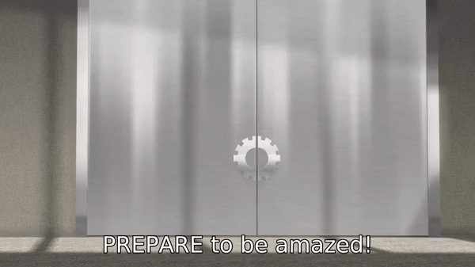

The solution I came up with is using functions that return the absolute address of the resource I'm looking for in `EAX`.

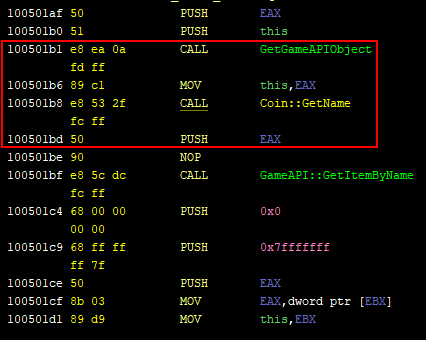

That way, my code doesn't use any absolute addresses (my `CALL` uses relative addresses to the current instruction), and the absolute address is correctly given to my code because the legitimate getter functions I'm using will certainly be adapted by the loader.

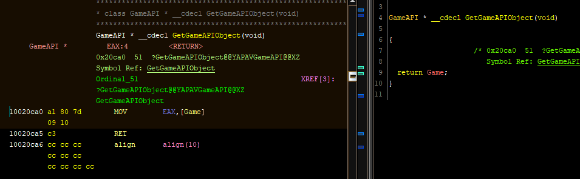

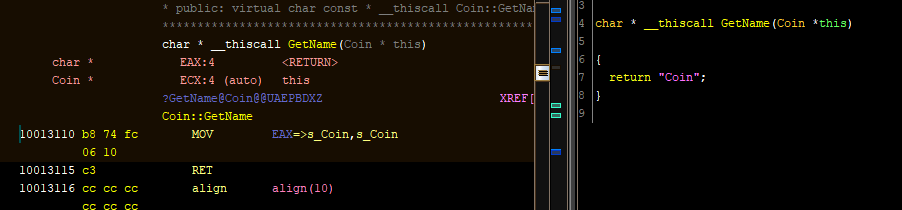

And below, is an illustration of what success looks like. As opposed to last episode's failure.

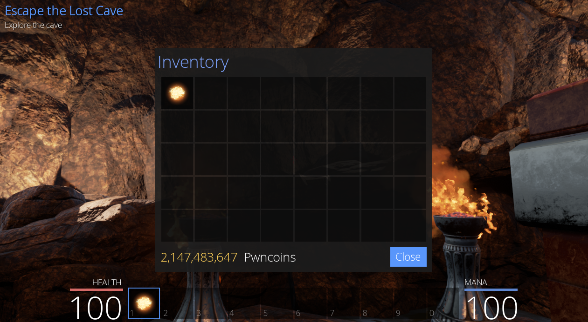

I tried to apply the same fix to adding coins on player creation but it always crashed when add item was called so I figured it's till too early to do it at this stage of the game.

###  VII - Bonuses

I've made some bonus patches for gaining movement speed, not paying in shops (without making price=0), and making instant kills. Since the patches don't introduce any new concepts and weren't particularly challenging compared to the patches I've made so far, I won't speak about them specifically. Their code will be added to the `apply_patches.py` file at the root of this repo. 

On a completely different note, there's something worth talking about but it's mostly unrelated to the patches I've made so far. This is actually something I learned while trying (and failing 😢) to reverse something else, and happened to run into in the `Player` constructor. It's about this instruction sequence. Putting  `0xf` in something, `0` in something 4 bytes before it, and `0` in something exactly 16 bytes before the second one. This is a "basic string" initialization. I can't recall how I got it but it was certainly a lot of looking it up and staring at the surrounding code.

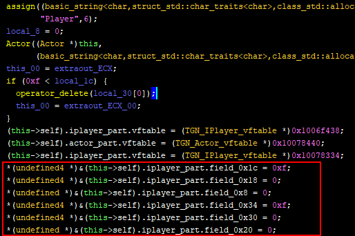

The image below represents what I worked out of a basic string format. The `capacity` represents the total number of bytes (excluding the terminating null byte) allocated for the string. The `length`field is the actual number of characters used inside the allocated bytes. The first field is either used as a 15-bytes long buffer or a as a pointer to a dynamically allocated buffer somewhere else. 

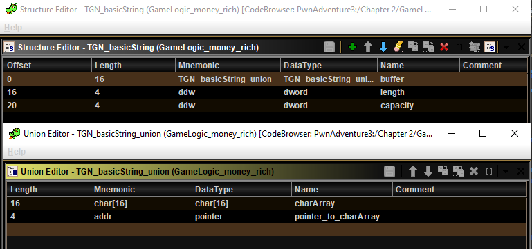

It looks like this after retyping. It comes in handy sometimes.

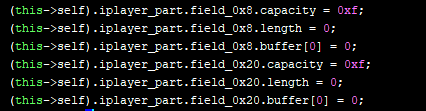

That's it for the bonus knowledge *Their Glamorous Noobness* has decided to bestow upon fellow noobs in this episode. I hope you found useful stuff in all of this. Thanks for reading! :)

----------------

Yatta yo, Gai sensei!

