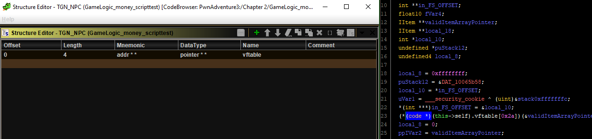
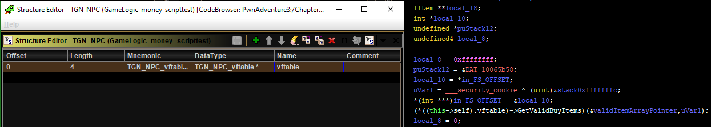

# Scripts created during this project

While suffering my way into understanding how to tackle this game, I had several ideas. Most of them demanded me to do stuff that was very repetitive and time-consuming. So I thought I'd automate it.

This folder contains the list of the scripts I've made so far.

You should not use any of them if you do not understand every single line and what it does.

## Scripts

### Vftable_activate_custom_variable_storage.py

It works like this:

- You place the cursor at the beginning of the vftable of `GlamorousClass`
- You run the script
- BAM all of its functions have custom variable storage enabled

Useful if one edits the "this" parameter type a lot and wants to save 3 boring clicks per modification. Useful for other cases too but I imagine one would use that only if they know why they're doing it.

### Rename_vftable_funcs.py

It works like this:

- You place the cursor at the beginning of the vftable of `GlamorousClass`
- You run the script
- BAM all of its functions that still had their default name are renamed to `TGN_GlamorousClass_vftable[index_in_vftable]`

Sometimes a derived class's vftable will contain a lot of the base class's functions. This script tries to make them easier to spot by giving the functions meaningful names about their position in a class's vftable.

The most convenient way to use this script in my opinion is to start with the base classes and then move down to the derived classes. You should check the RTTI structures in order to know class hierarchy.

It also sets the calling convention of the vftable functions to ` __this_call` ([default calling convention in c++ with a few exceptions](https://docs.microsoft.com/en-us/cpp/cpp/thiscall?view=vs-2019)), and activates custom variable storage. Custom variable storage is a prerequisite for retyping `this` from `void *` to `GlamorousClass *` for example (to be done manually or by other scripts)

### Create_vftable_type.py

It works like this:

- You place the cursor at the beginning of the vftable of `GlamorousClass`
- You run the script
- BAM the new type `TGN_GlamorousClass_vftable` is created in the `TGN` category and all of its fields are function pointers ( `dword func(void) *`) with names identical to those of the vftable functions (unless `TGN_GlamorousClass_vftable` already exists, in which case the script does nothing.)

Before making the script, the best I could do in terms of readability of virtual function calls in the decompiler was this.

Saying that the first field in a class is called vftable and it is a reference to an array of pointers. What my scripts allows me to do now is creating a dedicated type for a class's vftable, one type per vftable. So instead of saying that vftable contains a reference to an array of pointer, I say it's a reference to a certain structure that has named fields, which will be named after the functions in the vftable. It looks like this:

Also, since the members of the vftable structure that my script creates are typed as `dword func(void) *` instead of normal pointers, the annoying `(code *)` cast disappears from the decompiler too.

The major disadvantage though is that if the names of the actual functions are edited, the names in the structure won't adapt to that. They are statically-named fields and have to be updated manually.